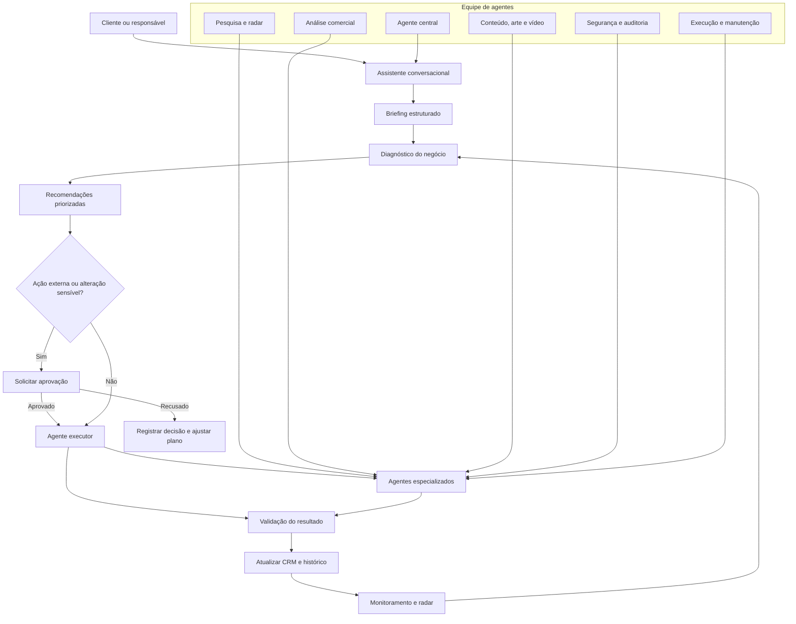

# Olho de Deus

Aplicação de prospecção baseada em OSINT público. Uma captura coordena etapas automáticas de coleta, normalização, deduplicação, verificação básica, score de confiança e organização local dos leads.

## Executar

```bash
npm install
npm run dev
```

A fonte padrão é Photon sobre dados OpenStreetMap, sem chave ou configuração externa. O endpoint `GET /health` informa a disponibilidade; `POST /api/capture` recebe `{ "query": "..." }`; a interface usa `GET /api/capture/stream?query=...` para progresso em tempo real.

## Expansão: CRM + radar de oportunidades

O Olho de Deus evolui de um radar de leads para um CRM de prospecção assistida, com uma camada de análise de aderência baseada na descrição do negócio, localização, segmento, oferta, presença digital e critérios definidos pelo usuário. O sistema deve explicar por que um lead foi classificado como compatível, revisar duplicidades e manter histórico de evidências e contatos.

### Módulos planejados

- **Radar configurável:** busca por segmento, região, palavras-chave, porte e sinais públicos de oportunidade.
- **Perfil de negócio:** consolidação de nome, categoria, canais públicos, localização, site, redes sociais e sinais observáveis.
- **Análise de aderência:** score transparente, critérios editáveis, evidências e nível de confiança; nunca promessas de resultado.
- **CRM:** etapas, status, notas, próximos passos, histórico, origem do lead e exportação.
- **Pesquisa empresarial:** consultas a fontes públicas e oficiais, incluindo registros empresariais disponíveis legalmente, como SINTEGRA quando aplicável.
- **Investigação responsável:** dados de pessoas físicas só podem ser tratados quando forem públicos, necessários, pertinentes ao objetivo comercial e obtidos de forma lícita; CPF não deve ser usado para enriquecimento indiscriminado, exposição ou perfil invasivo.
- **Sinte/Sintegra:** a integração deve ser confirmada antes de ser implementada; o sistema não deve inventar uma fonte nem coletar dados protegidos.

### Automação com controle humano

Agentes especializados podem pesquisar, normalizar, deduplicar, analisar e atualizar o CRM. O envio de mensagens, alterações de dados sensíveis, criação de perfis e ações externas exigem aprovação do usuário. Toda evidência deve ter origem, data de coleta, finalidade e possibilidade de revisão ou exclusão.

A arquitetura prioriza fontes públicas, conformidade com a LGPD, minimização de dados, segurança, trilha de auditoria e separação entre descoberta, análise e contato.

## Mapa interativo de agentes

A interface conversacional inclui um organograma clicável em [`src/components/AgentArchitecture.tsx`](src/components/AgentArchitecture.tsx); a arquitetura e o estado real dos módulos estão descritos em [`docs/architecture/agent-organogram.md`](docs/architecture/agent-organogram.md). No momento, apenas o pipeline OSINT existente é um backend comprovado; os outros agentes e serviços listados no mapa são planejados.

## Assistente conversacional de negócios

O Olho de Deus também funciona como um assistente conversacional para empresas e profissionais que não dominam marketing. A conversa transforma linguagem simples em um briefing estruturado, identifica objetivos, público, oferta, dificuldades, prioridades e próximos passos.

### Capacidades do assistente

- conversa guiada, sem exigir conhecimento técnico de marketing;
- criação automática de briefing a partir do diálogo;
- perguntas de esclarecimento somente quando necessário;
- diagnóstico comercial e de comunicação baseado em evidências;
- recomendações priorizadas para oferta, posicionamento, conteúdo, atendimento, arte, vídeo e jornada de conversão;
- geração de tarefas, calendário, textos, roteiros e direcionamentos visuais;
- execução de ações aprovadas pelo responsável;
- acompanhamento do que foi feito, do que está pendente e do que precisa ser revisado.

### Continuidade entre celular e computador

A conversa e o briefing devem permanecer sincronizados entre dispositivos por meio de um backend seguro. O celular e o computador funcionam como interfaces; o processamento, a memória do projeto, os agentes especializados e o histórico ficam em serviços cloud.

### Execução com aprovação

O assistente pode analisar, preparar e simular ações automaticamente. Mensagens, publicações, alterações em dados, campanhas e qualquer ação externa exigem confirmação explícita. Depois da aprovação, o agente executa, valida o resultado e registra a atividade no CRM.

O sistema deve separar: conversa, briefing, diagnóstico, recomendação, aprovação, execução e auditoria. Assim, a pessoa consegue conversar em linguagem natural e transformar a conversa em trabalho real sem perder controle.

## Fluxograma do ecossistema



### Dinâmica resumida

1. A pessoa conversa com o assistente.
2. O sistema transforma a conversa em briefing.
3. O diagnóstico identifica necessidades e oportunidades.
4. Agentes especializados montam o plano.
5. Ações externas aguardam aprovação.
6. O agente executor realiza a tarefa.
7. O resultado é validado e registrado.
8. O radar acompanha mudanças e inicia novos ciclos.

## Camada OSINT responsável + orquestrador Jarvis

O Olho de Deus usa OSINT como base para reunir, organizar e analisar informações públicas e legalmente acessíveis sobre negócios e oportunidades. O objetivo não é coletar “tudo” indiscriminadamente, mas encontrar dados relevantes, verificar a origem e apresentar evidências compreensíveis.

### Orquestrador genérico

Uma camada de orquestração no estilo Jarvis coordena tarefas e encaminha cada etapa ao agente adequado: busca pública, validação de empresa, análise comercial, CRM, conteúdo, segurança e execução autorizada. O orquestrador não deve agir como uma caixa-preta: cada resultado informa fonte, data, finalidade, confiança e limitações.

### Dados empresariais permitidos

- nome empresarial e nome fantasia;
- CNPJ quando obtido de fonte pública e pertinente;
- situação cadastral e atividade econômica em fonte oficial;
- endereço comercial e canais de contato publicados pela própria empresa;
- site, redes sociais, avaliações e sinais públicos de presença digital;
- notícias, editais, portais públicos e informações comerciais relevantes;
- relações e evidências necessárias para qualificar uma oportunidade B2B.

### Proteção de pessoas físicas

CPF, dados pessoais sensíveis, informações financeiras, credenciais, vazamentos, localização privada e perfis invasivos não fazem parte de uma coleta automática. Qualquer validação de pessoa física deve ter finalidade legítima, necessidade, base legal e consentimento quando aplicável. O sistema não deve buscar, cruzar ou expor dados pessoais apenas porque estão disponíveis na internet.

### Regras de segurança

O módulo OSINT não acessa contas privadas, não burla CAPTCHA ou autenticação, não compra bases vazadas, não faz doxxing, não realiza vigilância de pessoas e não envia contato automaticamente. Ações externas e uso de dados em prospecção exigem aprovação do responsável.

### Pipeline

```text
Consulta do usuário → Fontes públicas permitidas → Coleta mínima
→ Normalização → Deduplicação → Verificação de origem
→ Score de confiança → Análise de aderência → CRM
→ Aprovação humana → Ação autorizada → Auditoria
```

## Airtable como base operacional

O Airtable será a base operacional do Olho de Deus para persistir leads, evidências, briefings, análises, status e histórico. A interface do Olho de Deus continua exibindo os dados de forma amigável; o Airtable funciona como armazenamento, consulta e auditoria, não como uma tela obrigatória para o cliente.

Tabela criada: **Olho de Deus - Prospects**. Ela separa negócios e oportunidades das tabelas de vagas, clientes e códigos já existentes.

### Sincronização

- nova descoberta OSINT → registro ou atualização no Airtable;
- alteração no CRM → atualização sincronizada na interface;
- briefing da conversa → salvo no prospect;
- evidência, fonte e data → preservadas para auditoria;
- duplicidades → consolidadas sem apagar histórico;
- informações desatualizadas → marcadas para nova verificação;
- exclusão ou correção → refletida nos dois lados.

A pessoa continua vendo no Olho de Deus os dados, fontes, score, briefing, status e histórico. O Airtable fica como base de persistência e controle interno, com credenciais mantidas somente no backend.

